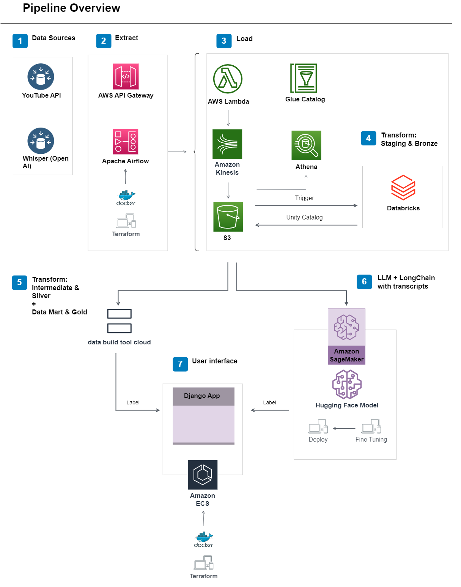

# From Raw Video to Business Intelligence: A Production-Grade Data Platform on AWS and Databricks


---

## The Problem Worth Solving

Every organization accumulates recorded content. Customer calls, internal training sessions, product demos, conference talks. The volume grows, the storage costs pile up, and yet the actual value locked inside that content stays completely out of reach.

Nobody has time to watch hundreds of hours of footage to extract a single data point. There is no way to search across recordings for recurring themes or patterns. New team members cannot tap into the knowledge that exists in those files. And leadership has no data-driven view into what content actually moves the needle.

The result is a growing archive that costs money to store and produces nothing in return.

This platform was built to close that gap.

---

## What Gets Built

Using YouTube video content as the data source, this platform pulls raw video data automatically, converts speech to text through AI transcription, runs it through a structured processing pipeline, and produces two concrete outputs:

**A structured analytics mart** giving teams a clean, dependable foundation to measure content performance, track engagement over time, and identify where audience attention breaks down.

**A fine-tuned AI assistant** capable of answering questions using the actual words and concepts from the video library, not recycled web results or hallucinated responses.

The underlying architecture is source-agnostic. Any organization with a library of audio or video recordings, whether that is call center data, compliance training, recorded webinars, or internal knowledge sessions, can apply this same pipeline to their content.

---

## Architecture Diagram



Three processing layers take data from raw and untrusted to clean and business-ready.

**Bronze** captures everything at ingestion without modification. Video metadata and transcriptions are written to S3 as-is, preserving a complete historical record that can be reprocessed at any point.

**Silver** applies structure and trust. Databricks and Spark handle schema enforcement, deduplication, format standardization, and automated quality checks so that only validated data advances.

**Gold** delivers value. dbt builds the final analytics layer: normalized dimensional models, business metrics, and content attributes that analysts and downstream AI systems can rely on without second-guessing the data underneath.

---

## How Data Moves Through the System

A scheduled Airflow pipeline connects to the YouTube API and collects video metadata across each run, capturing titles, descriptions, view counts, likes, comment volumes, publish dates, and duration. Simultaneously, OpenAI Whisper processes the audio track of each video and produces a full text transcription. Metadata arrives in S3 as JSON and transcriptions land as Parquet files.

An AWS Lambda function monitors S3 for incoming data and triggers the Databricks processing layer the moment new files arrive. Spark jobs take over from there, unpacking nested JSON payloads, resolving duplicate records, applying consistent data types, and validating output quality through automated test functions. The entire process runs without manual steps.

Validated data moves into dbt Cloud where dimensional modeling shapes it into a Snowflake schema normalized to third normal form. Source freshness checks, referential integrity tests, and null constraints run on every pipeline execution, catching problems before they reach any downstream consumer.

The transcription data feeds a separate workflow where a Large Language Model is fine-tuned against the full content corpus. A Django application running on AWS ECS handles inference requests, returning answers that reference the actual subject matter from the video library rather than producing generic outputs.

---

## Engineering Decisions and the Reasoning Behind Them

**Choosing dbt over Spark for the transformation layer**

Spark is well suited for large-scale processing but produces transformation logic that lives entirely in application code. That creates a visibility problem: only engineers can read it, audit it, or modify it safely. dbt moves transformation logic into SQL, version controls every change, and runs tests automatically on each deployment. For a layer that business stakeholders and analysts depend on directly, that auditability and testability justified the switch.

**Event-driven ingestion over time-based polling**

Polling on a fixed schedule means the pipeline runs whether or not there is anything new to process. Connecting ingestion to S3 arrival events through Lambda eliminates that waste entirely. Processing starts when data is actually present, which reduces compute spend and shortens the time between data landing and data being available downstream.

**Building a purpose-specific dataset rather than using an existing one**

Public datasets arrive pre-cleaned and pre-structured. They are useful for learning but they do not surface the real challenges that production data pipelines encounter. Raw YouTube API responses include nested objects, inconsistent field populations, schema variations across API versions, and records that require significant normalization work. Designing the pipeline around genuinely raw source data produced a more honest representation of production engineering conditions.

---

## Tech Stack

| Layer | Technology |
|---|---|
| Infrastructure as Code | Terraform, Ansible |
| Containerization | Docker, Docker Compose |
| CI/CD | GitHub Actions |
| Orchestration | Apache Airflow |
| Cloud Storage and Eventing | AWS S3, Lambda, Kinesis, API Gateway |
| Data Processing | Databricks, PySpark, Spark SQL |
| Transformation and Modeling | dbt Cloud |
| AI Transcription | OpenAI Whisper |
| LLM Fine-tuning | LangChain, Hugging Face |
| Application Layer | Django on AWS ECS |
| Analytics | AWS Athena |

---

## Project Structure

```
├── handlers-airflow/     # Terraform, Ansible, Airflow DAGs, Docker Compose
├── databricks/           # PySpark and Spark SQL transformation jobs
├── app_dbt/              # dbt Cloud models, tests, and documentation
├── aws/                  # Lambda functions, Kinesis config, Glue jobs
├── application/          # Django app, ECS Terraform, Docker setup
├── data/                 # Sample data across Bronze, Silver, and Gold layers
└── samples/              # Output samples from each pipeline stage
```

---

## Roadmap

- Deploy LLM inference via AWS SageMaker with Hugging Face PEFT techniques
- Build a Streamlit front-end for the user-facing Q&A interface
- Connect Power BI or Looker for content performance dashboards
- Extend the platform to support real-time ingestion with Spark Structured Streaming and Kafka
- Introduce data contracts at the ingestion boundary to enforce schema guarantees upstream

---

## About
[LinkedIn](#) · [GitHub](https://github.com/AtharvaGitProfile)
