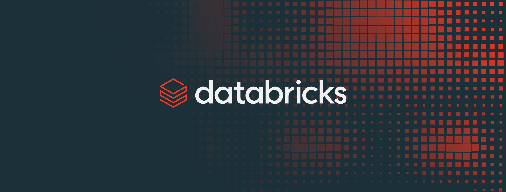

# From Raw Video to Business Intelligence
### A Production-Grade Data Platform on AWS and Databricks



<p align="center">
  <a href="https://AtharvaGitProfile.github.io/Databricks-ML-Platform/demo.html"><strong>▶ &nbsp;Click here — View the Production Demo</strong></a>
  &nbsp;&nbsp;·&nbsp;&nbsp;
  <a href="https://github.com/AtharvaGitProfile">GitHub</a>
  &nbsp;&nbsp;·&nbsp;&nbsp;
  <a href="#">LinkedIn</a>
</p>

<p align="center">
  
  
  
  
  
</p>

---

## The Problem Worth Solving

Every organization accumulates recorded content — customer calls, training sessions, product demos, conference talks. The volume grows, storage costs pile up, and the value locked inside stays completely out of reach.

Nobody has time to watch hundreds of hours of footage to extract a single data point. New team members cannot tap into the institutional knowledge buried in those files. Leadership has no data-driven view into what content actually moves the needle.

**This platform was built to close that gap.**

---

## Architecture Overview


The platform follows the **Medallion Architecture** across three processing layers:

| Layer | Purpose | Technology |
|---|---|---|
| **Bronze** | Raw ingestion — immutable, append-only | Databricks, S3, Unity Catalog |
| **Silver** | Schema enforcement, deduplication, quality validation | PySpark, Spark SQL, Glue Catalog |
| **Gold** | Dimensional modeling, business metrics, analyst-ready | dbt Cloud, AWS Athena |

---

## What the Platform Delivers

Using YouTube video content as the data source, the platform pulls raw video data automatically, converts speech to text through AI transcription, and processes it through a fully automated pipeline.

**Output: a structured analytics mart** giving teams a clean, dependable foundation to measure content performance, track engagement over time, and identify where audience attention breaks down.

The architecture is source-agnostic — any organization with a library of audio/video recordings (call center data, compliance training, recorded webinars) can apply this same pipeline.

---

## How Data Moves Through the System

**Stage 1 — Extraction**

A scheduled Airflow DAG connects to the YouTube Data API and collects video metadata: titles, descriptions, view counts, likes, comment volumes, publish dates, and duration. Simultaneously, OpenAI Whisper processes each video's audio track and produces a full-text transcription. Metadata arrives in S3 as JSON; transcriptions land as Parquet.

**Stage 2 — Event-Driven Trigger**

An AWS Lambda function monitors S3 for incoming data and fires the moment new files arrive. It publishes an event to Amazon Kinesis, which triggers the Databricks processing cluster. No polling, no wasted compute — processing starts only when data is actually present.

**Stage 3 — Bronze Layer**

Databricks writes all incoming data to the Bronze layer exactly as received. No schema enforcement, no transformations. This immutable record allows any downstream layer to be reprocessed from source at any point.

**Stage 4 — Silver Layer**

Spark jobs unpack nested JSON payloads, resolve duplicate records, apply consistent data types, and run automated quality validation. Only records that pass all checks advance. Failed records are quarantined — the Bronze source is never modified.

**Stage 5 — Gold Layer**

Validated data moves into dbt Cloud where dimensional modeling shapes it into a Snowflake schema normalized to third normal form. Source freshness checks, referential integrity tests, and null constraints run on every deployment. All logic is version-controlled SQL — auditable by anyone on the team.

**Stage 6 — Infrastructure as Code**

Every resource — S3 buckets, Lambda functions, Databricks clusters, VPCs — is defined in Terraform and provisioned reproducibly. Ansible handles configuration. Docker handles local development. GitHub Actions runs CI/CD on every commit.

---

## Engineering Decisions

**Why dbt over Spark for the transformation layer**

Spark produces transformation logic that lives entirely in application code — only engineers can read, audit, or safely modify it. dbt moves transformation logic into SQL, version controls every change, and runs tests automatically on each deployment. For a layer that business stakeholders depend on directly, that auditability justified the switch.

**Why event-driven ingestion over time-based polling**

Polling on a fixed schedule means the pipeline runs whether or not there is anything new to process. Connecting ingestion to S3 arrival events through Lambda eliminates that waste entirely — reducing compute spend and shortening time-to-availability.

**Why build a custom dataset instead of using a public one**

Public datasets arrive pre-cleaned and pre-structured. They do not surface the real challenges production pipelines encounter. Raw YouTube API responses include nested objects, inconsistent field populations, and schema variations that require significant normalization work. Building around genuinely raw source data produced a more honest engineering exercise.

---

## Tech Stack

| Layer | Technology |
|---|---|
| Infrastructure as Code | Terraform, Ansible |
| Containerization | Docker, Docker Compose |
| CI/CD | GitHub Actions |
| Orchestration | Apache Airflow |
| Ingestion & Eventing | AWS S3, Lambda, Kinesis, API Gateway |
| Data Processing | Databricks, PySpark, Spark SQL |
| Cataloging | AWS Glue, Unity Catalog |
| Transformation & Modeling | dbt Cloud |
| AI Transcription | OpenAI Whisper |
| Analytics | AWS Athena |

---

## Project Structure
```
├── handlers-airflow/
│   └── airflow-project/
│       ├── abstract_classes/     # Base classes for extensible operator patterns
│       ├── config/               # Environment and connection configuration
│       ├── dags/                 # Airflow DAG definitions
│       ├── factories/            # Factory patterns for dynamic task generation
│       ├── hooks/                # Custom hooks for external service connections
│       ├── operators/            # Custom Airflow operators
│       ├── processors/           # Data processor logic decoupled from DAGs
│       ├── src/                  # Core ingestion and transformation source code
│       ├── templates/            # Jinja templates for dynamic SQL and config
│       └── tests/                # Unit and integration tests for DAGs
│
├── databricks/
│   ├── Databricks - Spark Transformations (staging layer notebook)
│   └── README.md
│
├── app_dbt/
│   ├── analyses/                 # Ad-hoc analytical SQL
│   ├── macros/                   # Reusable dbt macros
│   ├── models/                   # Bronze, Silver, and Gold dbt models
│   ├── seeds/                    # Static reference data
│   ├── snapshots/                # Slowly changing dimension snapshots
│   ├── tests/                    # Custom dbt data tests
│   ├── dbt_project.yml
│   └── packages.yml
│
├── aws/
│   ├── databricks_logs/
│   │   ├── connection.txt        # Databricks connection config reference
│   │   └── trigger.txt           # Lambda trigger configuration reference
│   ├── lambda_logs/
│   │   ├── lambda_1.txt          # Lambda execution logs — sample run 1
│   │   └── lambda_2.txt          # Lambda execution logs — sample run 2
│   ├── lambda.py                 # S3-event Lambda function
│   ├── lambda_kinesis.py         # Kinesis-trigger Lambda function
│   └── README.md
│
├── application/
│   ├── application/              # Django project settings
│   ├── apps/alunos/              # Django app scaffold (inference layer — in progress)
│   ├── infra/                    # ECS Terraform definitions (planned deployment)
│   ├── static/ · templates/      # Static assets and HTML templates
│   ├── Dockerfile
│   ├── manage.py
│   └── requirements.txt
│
├── data/
│   ├── bronze/                   # Sample Bronze layer data
│   ├── silver/                   # Sample Silver layer data
│   └── gold/                     # Sample Gold layer data
│
├── samples/
│   ├── airflow/                              # Airflow DAG run samples and logs
│   ├── aws/                                  # AWS service output samples
│   ├── databricks_spark_logs/queries         # Spark job logs and query samples
│   ├── dbt_lineage_manifest_and_docs/        # dbt lineage graph and generated docs
│   └── python_script_without_airflow/        # Standalone scripts for local testing
│
├── DB.png
├── diagram.png
└── README.md
```

---

## What's Built vs. What's Planned

### ✅ Built and Working

- End-to-end ingestion: YouTube API → Airflow → S3 → Lambda → Kinesis → Databricks
- Medallion Architecture with Bronze, Silver, and Gold layers fully operational
- dbt dimensional modeling with 14 models and 31 automated tests
- AI audio transcription via OpenAI Whisper with Parquet output to S3
- All infrastructure defined as code in Terraform and Ansible
- CI/CD pipeline via GitHub Actions

### 🔜 In Progress / Planned

- **LLM fine-tuning on Amazon SageMaker** using Hugging Face PEFT techniques. 
- **Real-time streaming** with Spark Structured Streaming and Kafka to replace the current batch ingestion
- **BI Dashboard** connecting Power BI or Looker to the Gold layer
- **Data contracts** at the ingestion boundary to enforce schema guarantees upstream

---

## Running the Project

**Prerequisites:** AWS account, Databricks workspace, dbt Cloud account, Docker, Terraform >= 1.5
```bash
# Provision infrastructure
cd handlers-airflow/airflow-project/infra
terraform init && terraform apply
ansible-playbook playbook.yml

# Start Airflow locally
cd handlers-airflow/airflow-project
docker-compose up -d

# Run dbt models
cd app_dbt
dbt deps && dbt run --select staging gold && dbt test
```

---

## About

Built by [Atharva](https://github.com/AtharvaGitProfile) · [GitHub Repo](https://github.com/AtharvaGitProfile/Databricks-Data-Engineering-Platform) · [LinkedIn](#)
